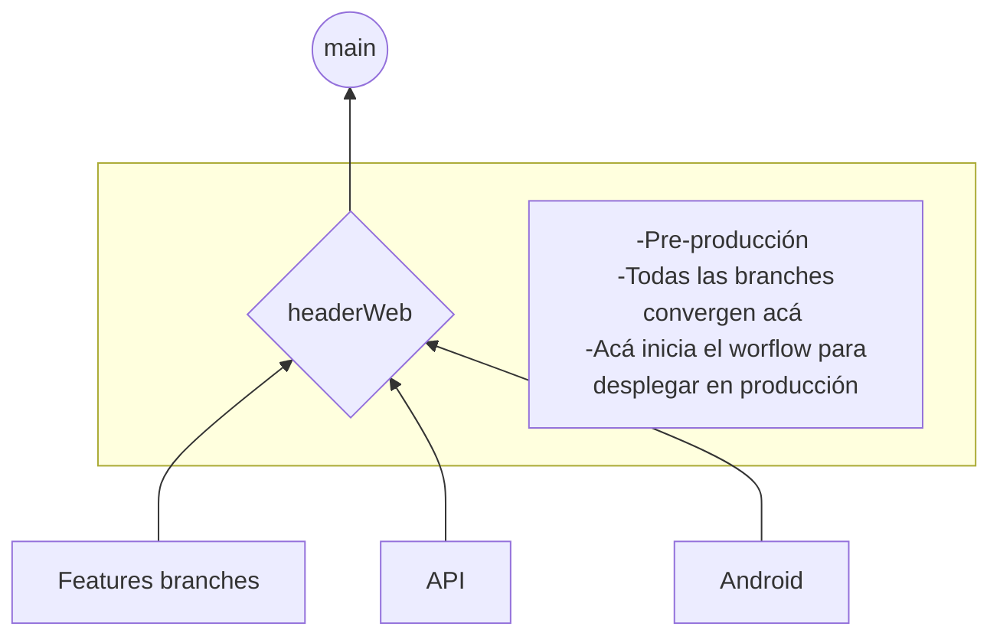

```mermaid
graph BT
    %% Definimos los orígenes abajo
    API[API]
    Android[Android]
    Feature[Features branches]

    %% Agrupamos el Header en el medio
    subgraph Header_Context [ ]
        direction LR
        Header{headerWeb}
        Info[ -Pre-producción </br> -Todas las branches convergen acá </br> -Acá inicia el worflow para desplegar en producción]
    end

    %% El destino final arriba
    Main((main))

    %% Conexiones (el flujo sube)
    Feature --> Header
    API --> Header
    Android --> Header
    Header --> Main
```